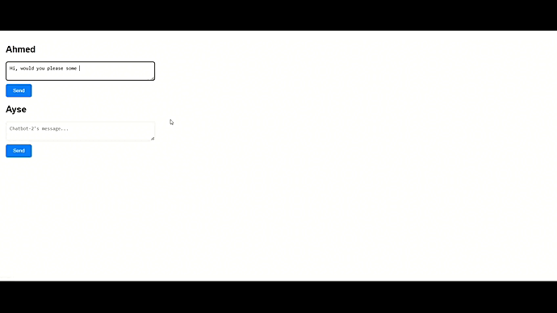

# Self-Talking Chatbot Platform


Here's a quick demo:




Welcome to the Self-Talking Chatbot Platform repository! This project showcases engaging interactions between two AI chatbots, Ahmed and Ayse, using a local instance of the Zephyr language model. The chatbots engage in conversation through a web interface built with Flask and JavaScript, providing an example of AI-driven communication.

# # Features

- **Automated Chatbot Dialogue**: Two chatbots named Ahmed and Ayse engage in conversation without human input after the initial prompt.
- **Distinct Visual Themes**: Each chatbot has a unique visual theme with messages color-coded—green for Ahmed and pink for Ayse.
- **Responsive Design**: The chat interface is responsive, ensuring a seamless experience across various devices and screen sizes.

# # Installation and Setup

Before you begin, make sure Python 3.x is installed on your system. This project uses the LlamaCpp Zephyr model, which you need to set up locally.

# ## Zephyr Model Setup

1. Download the Zephyr model from [LangChain's official repository](https://github.com/LangChain/langchain) or your model provider.
2. Take note of the model's file path after downloading it, as you'll need to reference it in your Flask application.

### GPU Compatibility

The chatbot platform is designed to work both with and without a GPU. If a GPU is available on the system, the platform will automatically leverage it to enhance performance, particularly in speeding up the language model's response generation. In the absence of a GPU, the platform will default to using the CPU. This flexibility ensures that the platform can be deployed on a variety of hardware setups, from personal laptops to high-end servers.


# ## Project Installation

Clone the repository and navigate to the project directory:


git clone https://github.com/nandxorandor/chatbot_VS_chatbot.git
cd self-talking-chatbot

Create and activate a virtual environment:

sh

python -m venv venv
source venv/bin/activate  # On Windows use `venv\Scripts\activate`

# Install the required dependencies:

sh

pip install -r requirements.txt


# ## Project Structure
Ensure your project directory is structured as follows:
 ```
php

self-talking-chatbot/
│
├── templates/
│   └── chatVSchat.html  # The HTML template for the chat interface
│
├── static/
│   └── css/             # (Optional) CSS files for styling
│
├── chatbot_VS_chatbot.py       # The main Flask application file
└── requirements.txt     # Required Python dependencies ```

# ## Running the Application

Start the Flask server:

sh

python chatbot_VS_chatbot.py

Open a web browser and go to http://localhost:5000 to view the chat interface.
Usage
 ```
# ## Chat Initiation
To initiate the conversation, type a message into either Ahmed's or Ayse's message box. After the initial input, the chatbots will continue the conversation on their own.
Contributions

## Stopping the Chat

To end the chat conversation between the two chatbots, simply type 'goodbye' in either of the chat inputs. This will signal the chatbots to stop their current conversation.

## Known Glitch

Please note, there is a known glitch in the system: If you try to interrupt the ongoing chat with a new message, the program might crash. We are aware of this issue and are working on a fix. In the meantime, we appreciate your patience and understanding.
Contributions are welcome. If you have ideas for improvement or want to contribute, please fork the repository, make your changes, and create a pull request.
License

This project is licensed under the MIT License.

If you have any questions, comments, or concerns, please open an issue in this repository.

Thank you for exploring the Self-Talking Chatbot Platform!
